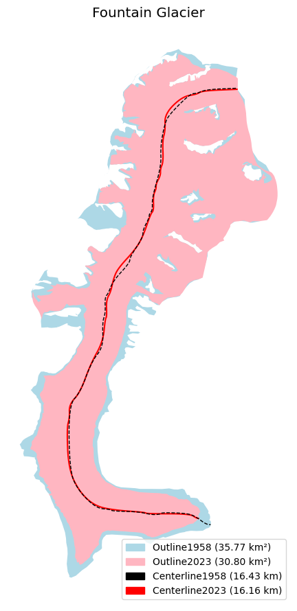

# Glacier Centerline Extraction using OGGM

This repository provides a Jupyter Notebook (`centerline.ipynb`) that demonstrates how to extract glacier centerlines using the [OGGM (Open Global Glacier Model)](https://oggm.org/) framework. The notebook offers a step-by-step guide to setting up OGGM, processing glacier data, computing centerlines, and visualizing results.

## Contents

- `centerline.ipynb`: A step-by-step notebook showcasing how to:
  - OGGM installation and setup
  - Downloading and preprocessing glacier data from the RGI
  - Computing glacier centerlines using OGGM’s routing algorithms
  - Visualizing glacier outlines and centerlines with matplotlib and geopandas
-Example Output:
Example visualization of a glacier and its computed centerline

### Requirements

Make sure you have the following Python packages installed:
- `oggm`
- `matplotlib`
- `geopandas`
- `xarray`
- `shapely`
- `pyproj`

### References

OGGM Documentation: https://docs.oggm.org

RGI Consortium: https://www.glims.org/RGI/
